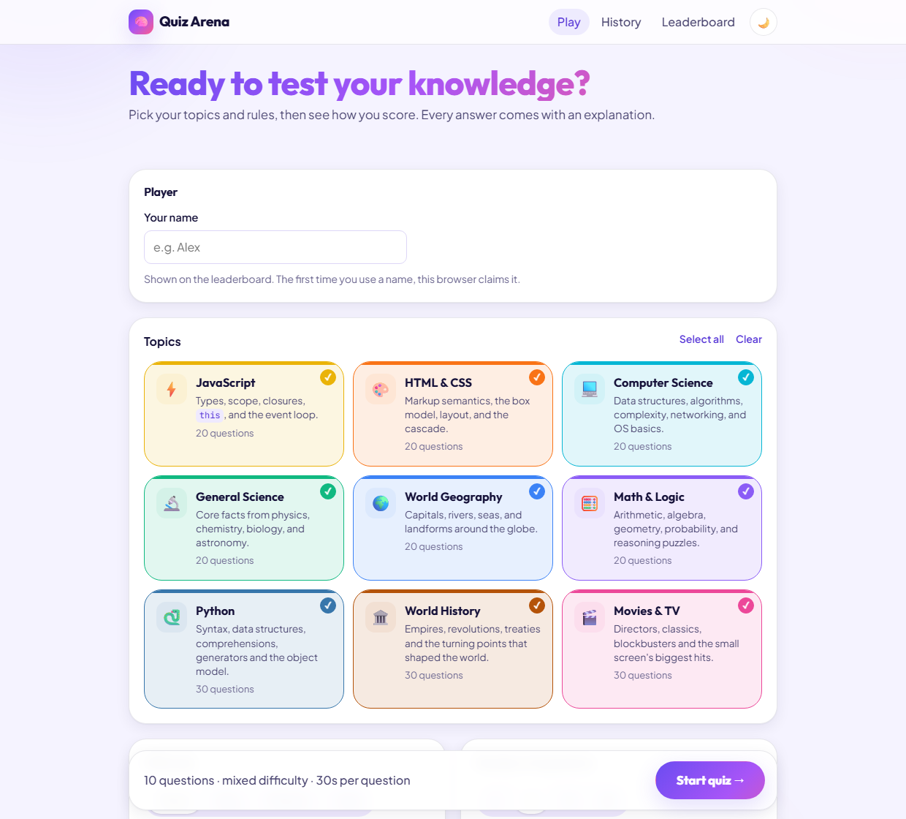

# Quiz Arena

[](https://github.com/vaibhavvaid14/quiz-arena/actions/workflows/kotlin.yml)

**[Play it live](https://quiz-arena-kotlin.onrender.com/)** — hosted free, so the service
sleeps when idle and the first request has to wake it.



A timed multiple-choice quiz app backed by a real database. Answers get instant
feedback and explanations, and there are score analytics, per-player history and
a shared leaderboard. 210 questions across 9 topics, from JavaScript and Python
to world history and film.

**Kotlin throughout**, in three Gradle modules:

| | |
|---|---|
| `shared` | Models and scoring rules, compiled for **both** the JVM and the browser |
| `server` | [Ktor](https://ktor.io) on Netty, SQLite over JDBC, server-side scoring |
| `client` | Kotlin/JS, no framework — the DOM toolkit is about a hundred lines |

The shared module is the reason this is one language rather than two. The API's
request and response types are declared once and compiled into both the server
and the browser, so renaming a field breaks the build on both sides at the same
time. A server and a client that merely agree by convention cannot do that.

## Run it

```bash
./gradlew :server:run      # http://127.0.0.1:8000/
```

That builds the Kotlin/JS bundle, points the server at it and starts both. You
need a JDK 21; Gradle comes from the wrapper.

On first start the server creates `data/quiz.db`, applies the schema and loads
the 210 questions bundled with the jar. Every later start syncs any edits you
have made to `data/questions.json`.

| Variable | Meaning |
|---|---|
| `PORT` | port to listen on (default 8000) |
| `HOST` | interface to bind (default 127.0.0.1; a container needs 0.0.0.0) |
| `QUIZ_DB` | SQLite file (default `data/quiz.db`) |
| `QUIZ_STATIC` | directory holding `index.html`, `css/` and `js/` |
| `QUIZ_TEST` | `1` for a throwaway database that also serves `/tests/` |

## Test it

```bash
./gradlew :server:test     # 60 tests on the JVM
./gradlew :client:jsTest   # 15 tests in headless Chrome
```

**Server tests** cover the schema and its constraints, seeding, every quiz rule
including timer expiry (driven by a fake clock), leaderboard ranking, and the
HTTP layer itself: auth, the error envelope, request limits and the static file
allowlist, path traversal included.

**Client tests** cover the drift-free timer and device storage — the versioned
envelope, case-insensitive player names, corrupt and stale entries, and a
storage backend that throws on every call.

**End-to-end tests** drive the real application: they load the page in an
iframe and click through it, importing nothing from the app. They were written
against the previous JavaScript frontend and pass unchanged against the Kotlin
one, which is the point — they cannot have been adjusted to fit the new code.

```bash
./gradlew :server:buildFatJar :client:assembleTestWeb
QUIZ_TEST=1 QUIZ_STATIC=client/build/web-test java -jar server/build/libs/server-all.jar
# then open http://127.0.0.1:8000/tests/
```

The page title becomes `PASS n/n` or `FAIL n/n`, so it also works headless:

```bash
chrome --headless=new --virtual-time-budget=180000 --dump-dom http://127.0.0.1:8000/tests/
```

## Deploy it

Built and run as a container, because Render has no native JVM runtime. In the
Render dashboard choose **New > Blueprint**, pick this repo and apply; it reads
[render.yaml](render.yaml) and builds from the [Dockerfile](Dockerfile), which
compiles the server jar and the Kotlin/JS bundle and ships both.

On the free plan the disk is wiped on every deploy and the service sleeps after
about fifteen minutes idle, so scores do not survive a restart. Waking it is
quicker than it sounds: the application starts in well under a second, and a
cold request measured about 1.1 s end to end. Questions re-seed on every boot,
so the quiz itself always works. `render.yaml` shows the disk and `QUIZ_DB`
settings that make scores permanent.

## How it works

```
Browser (client/)                    Server (server/)                 SQLite
─────────────────                    ────────────────                 ──────
screens ── Api ── fetch JSON ──►  Routing      routes, errors,  ──►  topics, questions,
Timer (display only)                           static files          question_options,
Storage (player key,              QuizService  quiz rules            players, attempts,
  resume id, prefs)               Rules        scoring constants     attempt_questions
                                  Seeder       questions.json → DB
        ▲                         Database     connections, migrations
        └───────── shared: models + scoring rules ─────────┘
```

**The server is in charge.** A quiz app that ships its answer key to the browser
can be beaten with devtools, so this one doesn't:

- **Answers stay secret until you answer.** The browser gets options without
  answers. The correct option and the explanation arrive only once that question
  is settled.
- **Server clock only.** Time is measured by the server, minus a 300 ms
  allowance for network delay, so the browser can't claim it answered faster
  than it did.
- **Closing the tab doesn't stop the clock.** Every request first settles any
  clock that ran out ("lazy expiry"). A tab closed mid-quiz still times out, and
  a whole-quiz countdown still submits the quiz.
- **Reading explanations is free.** A question's clock stops when you answer and
  the next one starts only when you ask for it.
- **Double-clicks and retries are harmless.** Answering twice or clicking "next"
  twice returns the current state instead of erroring. A stale tab gets a 409
  and reloads the real state.

**Players.** There are no passwords. Using a name for the first time claims it
and returns a secret key, which the server stores only as a SHA-256 hash. The
browser keeps the key and sends it as `X-Player-Key`. Another browser can't use
that name, and attempts are private to their owner.

**Concurrency.** One SQLite connection behind a lock: SQLite has a single writer
regardless, and `BEGIN IMMEDIATE` is easier to reason about that way. The lock
matters because Ktor serves requests on many threads. Nested transactions join
the outer one rather than issuing a second `BEGIN`, which SQLite rejects.

**Database design** ([schema.sql](server/src/main/resources/schema.sql)):

- **Answer options are rows**, not a JSON list. A partial unique index
  guarantees at most one correct option per question.
- **History can't be rewritten.** `attempt_questions.selected_option_id` is a
  foreign key with `ON DELETE RESTRICT`, so an option someone chose can never
  disappear. The seeder also refuses to change the options of a question that
  has already been played.
- **Questions are never deleted.** Removing one from the JSON deactivates it, so
  old attempts stay reviewable.
- **Finished attempts store their score summary**, so history and the
  leaderboard are single indexed queries. The leaderboard uses window functions
  (`ROW_NUMBER() OVER (PARTITION BY player …)`).
- **Engine settings:** foreign keys on, WAL journal, `BEGIN IMMEDIATE` write
  transactions, and schema versioning with `PRAGMA user_version`.

## API

All responses are JSON. Errors look like `{"error": {"code", "message"}}`.
Routes marked 🔑 need the `X-Player-Key` header.

| Method | Path | Purpose |
|---|---|---|
| GET | `/api/catalog` | topics with question counts, plus scoring rules |
| POST | `/api/players` | claim a name → `{id, name, key}` (409 if taken) |
| GET | `/api/me` 🔑 | who this key belongs to |
| GET / DELETE | `/api/me/history` 🔑 | stats, topic mastery, attempts / clear them |
| POST | `/api/attempts` 🔑 | start a quiz (optional `questionIds` for "retry missed") |
| GET / DELETE | `/api/attempts/{id}` 🔑 | current state / discard an unfinished quiz |
| POST | `/api/attempts/{id}/answer` 🔑 | `{position, optionId}`; `optionId: null` = timed out |
| POST | `/api/attempts/{id}/next` 🔑 | `{position}` |
| POST | `/api/attempts/{id}/finish` 🔑 | end now (time-up or quit, decided by the server) |
| GET | `/api/attempts/{id}/results` 🔑 | summary and full review |
| GET | `/api/leaderboard?limit=20` | top players (a valid key also returns your own rank) |

## Topics

210 questions across 9 topics, each with an easy / medium / hard spread and a
written explanation. A test enforces the spread and keeps the correct answer
from clustering on one position.

| Topic | Questions | Covers |
|---|---|---|
| ⚡ JavaScript | 20 | Types, scope, closures, `this`, and the event loop |
| 🎨 HTML & CSS | 20 | Markup semantics, the box model, layout, and the cascade |
| 💻 Computer Science | 20 | Data structures, algorithms, complexity, networking, and OS basics |
| 🔬 General Science | 20 | Core facts from physics, chemistry, biology, and astronomy |
| 🌍 World Geography | 20 | Capitals, rivers, seas, and landforms around the globe |
| 🧮 Math & Logic | 20 | Arithmetic, algebra, geometry, probability, and reasoning puzzles |
| 🐍 Python | 30 | Syntax, data structures, comprehensions, generators and the object model |
| 🏛️ World History | 30 | Empires, revolutions, treaties and the turning points that shaped the world |
| 🎬 Movies & TV | 30 | Directors, classics, blockbusters and the small screen's biggest hits |

## Adding questions

Edit `data/questions.json`, then restart the server. Each question looks like
this:

```json
{
  "id": "js-h07",
  "topic": "javascript",
  "difficulty": "hard",
  "question": "What does this log?",
  "code": "console.log(typeof null)",
  "options": ["\"null\"", "\"object\"", "\"undefined\"", "\"number\""],
  "answer": 1,
  "explanation": "A legacy quirk: typeof null is \"object\"."
}
```

The whole file is validated before anything is written, and one bad question
rejects the sync — with every problem reported, not just the first. To change
the options of a question people have already played, give it a new id; the old
one is retired automatically.

## Scoring

| | Points |
|---|---|
| Correct answer | 10 easy · 20 medium · 30 hard |
| Speed bonus (per-question timer only) | up to +50% of base, in proportion to time left |
| Wrong answer | 0, or −25% of base with negative marking (total never below 0) |
| Timed out / skipped | 0 |

The percentage score is correct answers ÷ questions. Grades: A ≥ 90, B ≥ 75,
C ≥ 60, D ≥ 40, F below.

The **leaderboard** shows each player's single best finished quiz of at least 5
questions, ranked by points. Quizzes ended early and "retry missed" runs don't
count.

## Known limits

- **Names aren't password-protected.** A name belongs to the browser that
  claimed it; clearing site data loses access to it. Real accounts would need
  sign-in.
- **Single machine only.** SQLite with one server process suits a class or a
  team. For many simultaneous users, move to PostgreSQL.
- **The bundle is not small.** Kotlin/JS ships its standard library, coroutines
  and the serialization runtime, so the compiled UI is a few hundred KB before
  compression — considerably more than the hand-written JavaScript it replaced.
  That is the price of one language and a compile-time-checked API contract.
- **Tested in Chrome.** The app uses `<dialog>`, CSS `:has()`, `color-mix()` and
  `backdrop-filter`, all supported by current Chrome, Edge, Firefox and Safari.
- **Fonts come from Google Fonts.** Offline, or anywhere that host is blocked,
  the UI falls back to system fonts and everything still works. The
  Content-Security-Policy allows exactly those two font hosts and nothing else.

## Licence

MIT. See [LICENSE](LICENSE).
